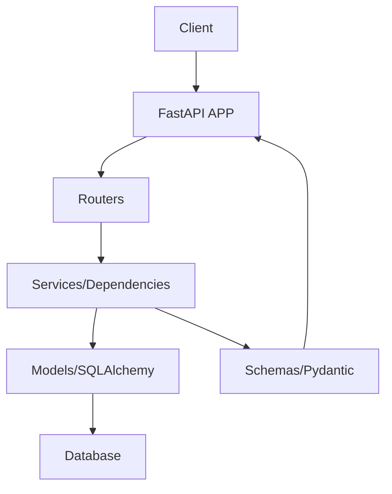

# Practicare FastAPI

O **Practicare** é um sistema de desenvolvido inicialmente como projeto de aprendizagem para aprimorar minhas habilidades e conhecimentos em desenvolvimento de software. Ele é composto por este projeto [**Practicare FastAPI**](https://github.com/psifabiohenrique/practicare_fastapi) e o [**Practicare Frontend**](https://github.com/psifabiohenrique/practicare_frontend).

O **Practicare FastAPI** foi desenvolvido utilizando FastAPI, um framework web moderno e de alta performance para Python. A escolha desse framework foi feita devido à sua crescente adoção no mercado de trabalho, devido ao seu bom suporte a typehints (permitindo um estudo mais declarativo sobre tipagem em Python) e devido ao seu carater menos opinativo, permitindo maior flexibilidade na implementação arquitetural, o que permite estudar melhor os fundamentos do desenvolvimento web.

<!--
[COMENTÁRIO: Espaço para Logotipo ou Banner do Projeto]

-->

## 🚀 Tecnologias Utilizadas

O projeto utiliza um conjunto de tecnologias modernas para garantir performance e manutenibilidade:

- **FastAPI**: Framework web moderno e de alta performance para Python.
- **SQLAlchemy**: Toolkit SQL e ORM para mapeamento de banco de dados.
- **Alembic**: Ferramenta de migrações leve para SQLAlchemy.
- **Pydantic**: Validação de dados e gestão de configurações.
- **PyJWT**: Implementação de JSON Web Tokens para autenticação.
- **Argon2**: Algoritmo de hashing de senhas seguro (via `pwdlib`).
- **Pytest**: Framework de testes para garantir a qualidade do código.
- **Ruff**: Linter e formatador de código extremamente rápido.
- **uv**: Gerenciador de dependências Python ultra-veloz.

## 🏗️ Arquitetura

O projeto segue uma arquitetura organizada por responsabilidades, facilitando a escalabilidade:



- **`src/main.py`**: Ponto de entrada da aplicação, onde o app FastAPI é instanciado e as rotas e middlewares são registrados.
- **`src/routers/`**: Define os endpoints da API, agrupados por funcionalidade (auth, users, patients).
- **`src/services/`**: (Opcional/Implementado conforme necessidade) Contém a lógica de negócio separada dos endpoints.
- **`src/models.py`**: Define os modelos de dados utilizando SQLAlchemy ORM.
- **`src/schemas/`**: Define os modelos de dados Pydantic para validação de entrada e saída (DTOs).
- **`src/security.py`**: Contém utilitários para hashing de senhas e geração/validação de tokens JWT.
- **`src/database.py`**: Configuração da conexão com o banco de dados e sessão.

## ✨ Funcionalidades

### 1. Autenticação e Segurança

- Login e geração de `access_token` e `refresh_token`.
- Middleware CORS configurado.
- Controle de acesso baseado em JWT.
- Hashing de senhas com Argon2.

### 2. Gestão de Usuários

- CRUD completo de usuários.
- Diferentes níveis de acesso ou papéis (Roles). (a implementar...)

### 3. Gestão de Pacientes e Tratamentos

- Listagem de pacientes com filtros avançados.
- Vínculo de tratamentos a pacientes em uma única unidade lógica.
- Ordenação, paginação e busca.

### 4. Gestão de Prontuários (A implementar...)

- Listagem de prontuários com filtros avançados.
- Vínculo de prontuários a tratamentos em uma única unidade lógica.
- Ordenação, paginação e busca.

### 5. Gestão de Relatórios (A implementar...)

- Listagem de relatórios com filtros avançados.
- Vínculo de relatórios a tratamentos em uma única unidade lógica.
- Ordenação, paginação e busca.

### 6. Gestão de Agendamentos (A implementar...)

- Listagem de agendamentos com filtros avançados.
- Vínculo de agendamentos a tratamentos em uma única unidade lógica.
- Ordenação, paginação e busca.

### 7. Gestão de Prescrições (A implementar...)

- Listagem de prescrições com filtros avançados.
- Vínculo de prescrições a tratamentos em uma única unidade lógica.
- Ordenação, paginação e busca.

<!--
[COMENTÁRIO: Espaço para Screenshot da documentação Swagger]
Sugestão: Imagem do endpoint /docs mostrando as rotas organizadas.
-->

## 🛠️ Como Executar

### Pré-requisitos

- Python 3.13+
- [uv](https://github.com/astral-sh/uv) (Recomendado)

### Configuração do Ambiente

1. Clone o repositório.
2. Crie um arquivo `.env` na raiz do projeto baseado no `.env.exemple`:

```bash
cp .env.exemple .env
```

3. Instale as dependências:

```bash
uv sync
```

### Comandos Úteis (via taskipy)

- **Rodar em Desenvolvimento**:
  ```bash
  task run
  ```
- **Executar Testes**:
  ```bash
  task test
  ```
- **Formatar Código**:
  ```bash
  task format
  ```
- **Linter**:
  ```bash
  task lint
  ```

## 🧪 Testes e Cobertura

O projeto possui uma suíte de testes abrangente utilizando `pytest`. Para rodar os testes e gerar um relatório de cobertura HTML:

```bash
task test
```

Após a execução, abra o arquivo `htmlcov/index.html` no seu navegador para visualizar o relatório detalhado.

<!--
[COMENTÁRIO: Espaço para Imagem do Relatório de Cobertura]
Sugestão: Screenshot do relatório de cobertura do Coverage.py mostrando alta porcentagem de testes.
-->

---

Desenvolvido com ❤️ para a gestão de saúde moderna.
