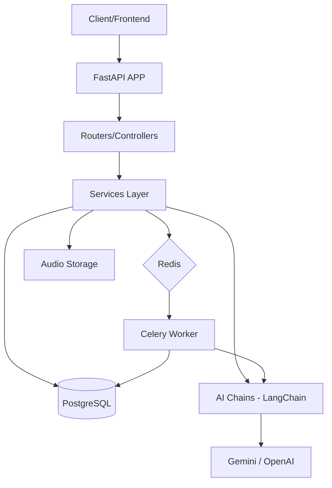

# Practicare FastAPI

O **Practicare** é um sistema desenvolvido para aprimorar a gestão de saúde, integrando automação por Inteligência Artificial para otimizar o fluxo de trabalho de profissionais da saúde. Ele é composto por este projeto [**Practicare FastAPI**](https://github.com/psifabiohenrique/practicare_fastapi) e o [**Practicare Frontend**](https://github.com/psifabiohenrique/practicare_frontend).

O **Practicare FastAPI** utiliza o framework FastAPI para oferecer uma API de alta performance, com tipagem robusta e processamento assíncrono, servindo como o motor de inteligência e persistência do ecossistema Practicare.

## 🚀 Tecnologias Utilizadas

O projeto utiliza um stack moderno focado em performance, escalabilidade e produtividade:

- **FastAPI**: Framework web moderno e de alta performance para Python.
- **SQLAlchemy (Async)**: Toolkit SQL e ORM com suporte a operações assíncronas.
- **Alembic**: Gerenciamento de migrações de banco de dados.
- **Celery & Redis**: Processamento de tarefas em segundo plano (IA e Transcrição).
- **LangChain**: Orquestração de cadeias de IA com suporte a múltiplos provedores.
- **Google Gemini & OpenAI**: Modelos de linguagem de última geração para automação clínica.
- **Pydantic v2**: Validação de dados rigorosa e gestão de configurações.
- **Pytest & Testcontainers**: Testes automatizados com banco de dados real em containers.
- **uv**: Gerenciador de dependências e ambiente Python ultra-veloz.
- **Docker & Docker Compose**: Padronização do ambiente de desenvolvimento e infraestrutura.

## 🏗️ Arquitetura

A aplicação segue uma arquitetura modular baseada em serviços e processamento assíncrono:



### Estrutura de Pastas Principal:
- **`src/routers/`**: Endpoints da API organizados por domínio.
- **`src/services/`**: Lógica de negócio e orquestração de fluxos.
- **`src/ai/`**: Implementação das cadeias de IA, prompts e integração com LLMs.
- **`src/tasks/`**: Definição de tarefas assíncronas do Celery.
- **`src/models/`**: Definições das tabelas SQLAlchemy (ORM).
- **`src/schemas/`**: Modelos Pydantic para validação e serialização (DTOs).
- **`src/core/`**: Configurações centrais, middlewares e utilitários globais.

## ✨ Funcionalidades Implementadas

### 1. Autenticação e Segurança
- Autenticação JWT com `access_token` e `refresh_token`.
- Proteção contra CSRF e CORS configurado.
- Hashing de senhas seguro com Argon2.

### 2. Gestão Clínica
- CRUD completo de pacientes e tratamentos.
- Vínculo inteligente entre pacientes, tratamentos e registros.

### 3. Automação por IA (Recurso Principal)
- **Transcrição de Áudio**: Conversão automática de áudios de consultas em texto estruturado.
- **Prontuários Automatizados**: Geração de registros clínicos (records) a partir de transcrições ou notas.
- **Relatórios Inteligentes**: Criação de relatórios de evolução (reports) baseados no histórico do tratamento.
- **Processamento Assíncrono**: Garantia de que a API permaneça rápida enquanto a IA processa grandes volumes de dados.

### 4. Monitoramento e Dashboards
- Painel de controle com estatísticas de atendimento.
- Rastreamento de uso de recursos de IA para controle de custos e performance.

## 🛠️ Como Executar

### Pré-requisitos
- Python 3.13+
- [uv](https://github.com/astral-sh/uv)
- Docker e Docker Compose

### Configuração do Ambiente

1. Clone o repositório.
2. Configure as variáveis de ambiente:
   ```bash
   cp .env.exemple .env
   ```
   *Certifique-se de preencher as chaves de API (`GOOGLE_API_KEY`, `OPENAI_API_KEY`) e as URLs de banco/redis.*

3. Instale as dependências:
   ```bash
   uv sync
   ```

4. Suba a infraestrutura (Postgres & Redis):
   ```bash
   docker compose up -d
   ```

5. Migre o banco de dados:
   ```bash
   alembic upgrade head
   ```

### Comandos de Execução (via taskipy)

- **API (Desenvolvimento)**: `task run`
- **Worker Celery**: `task celery`
- **Dashboard de Tarefas (Flower)**: `task flower`
- **Testes**: `task test`
- **Formatação/Lint**: `task format` / `task lint`

---
Desenvolvido com ❤️ para a gestão de saúde moderna.
